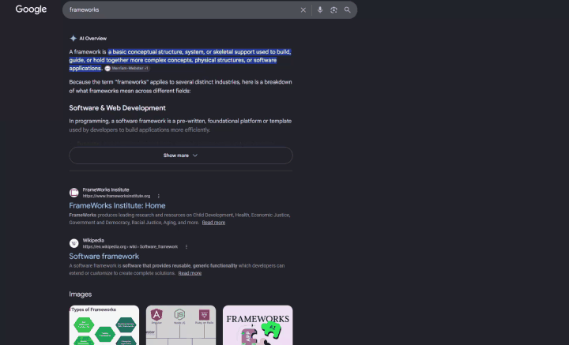

# FloatCalc

A minimalist, frameless desktop calculator that stays pinned on screen so your calculations never get lost while browsing webpages, working in spreadsheets, or switching between apps.

<div align="center">
  
  <p><em>Always-on-top window pinning, compound parentheses math, scientific drawer, and ghost mode opacity.</em></p>
</div>

---

## Why I Built It

Whenever I'm working across full-screen Excel sheets, research tabs, and workpapers, standard calculators get buried the second I click anywhere else. Constantly Alt-Tabbing or re-opening a calculator breaks focus, and basic calculators can't handle compound formulas with parentheses without losing your place.

I built FloatCalc to solve that daily friction: a clean, floating tool that stays pinned right where you need it, lets you adjust transparency so you can see numbers underneath it, and shows live equation previews as you type.

---

## Features

- **Always-On-Top Pinning (`Ctrl+P`)**: Keep the calculator floating above spreadsheets, browsers, and text editors without losing focus.
- **Ghost Mode Transparency**: Slide window opacity down to 30% to read numbers or tables directly through the calculator.
- **Parentheses & Compound Math**: Handles multi-step formulas with parentheses `( )`, order of operations, powers, and roots.
- **Live Equation Preview**: Shows the active formula in real time as you type before hitting equals.
- **Flyout Scientific Drawer (`Alt+S`)**: Clean toggle for trigonometry, exponents, logarithms, and constants ($\pi, e$) without cluttering the main keypad.
- **One-Click Copy**: Click the result to copy it straight to your clipboard with instant visual feedback.
- **Session History (`Alt+H`)**: Keep track of recent calculations and recall them with one click.
- **Frameless Acrylic Glass UI**: Modern, borderless dark-mode aesthetic designed to look native on Windows 11.

---

## Download & Run

### Portable Standalone App (No Installation)
1. Download **`FloatCalc-v1.0.0-Windows.zip`** from [GitHub Releases](https://github.com/AgniCompute/floatcalc/releases).
2. Extract the folder anywhere on your PC.
3. Run **`FloatCalc.lnk`** (or `FloatCalc.cmd`) to launch immediately. No administrator rights or installer needed.

### Run From Source (Developers)
```bash
# Clone the repository
git clone https://github.com/AgniCompute/floatcalc.git
cd floatcalc

# Install dependencies and launch
npm install
npm start
```

---

## Keyboard Shortcuts

| Shortcut | Action |
|---|---|
| `Ctrl + P` | Toggle Always-on-Top Pin |
| `Alt + S` | Toggle Scientific Drawer |
| `Alt + H` | Toggle Calculation History |
| `(` and `)` | Parentheses grouping |
| `^` | Power ($x^y$) |
| `Enter` or `=` | Calculate result |
| `Escape` or `C` | Clear |
| `Backspace` | Delete last character |

---

## Built With
- **Electron & Node.js**: Lightweight frameless desktop window management and IPC state.
- **HTML5 & CSS Acrylic Glass**: Translucent, backdrop-filtered design system.
- **Vanilla JavaScript**: Zero-dependency algebraic precedence evaluation and automated functional test suite.
